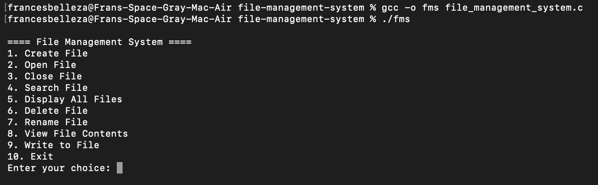

# File Management System

## Overview
This project is a simple terminal-based file management system written in C for Linux for CS 149. It simulates a small file system entirely in memory using a fixed-size array of file records — it does **not** create real files on the host operating system. All "files" live in the program's array for the duration of a run and disappear when the program exits. The user interacts through a menu (create, open, close, search, display, delete, rename, view, and write files).

## Main Functionalities

1. **Create File**
   - Creates a new empty record in the next free slot of the file array.
   - Prevents duplicate file names.
   - Returns an error if the array is full (max 50 files).

2. **Open File**
   - Marks an existing file record as open and stores its index as the currently open file.
   - The same open file is used for both viewing and writing.
   - Only one file can be open at a time.

3. **Close File**
   - Marks the currently open file as closed and clears the open-file index.
   - After closing, the user must open a file again before viewing or writing.

4. **Search File**
   - Searches the array for a file by name.
   - Reports whether it exists and whether it is currently open or closed.

5. **Display All Files**
   - Walks the array and lists every record currently in use, with its open/closed status.

6. **Delete File**
   - Marks a file's slot as free so it can be reused by the next Create.
   - Prevents deletion if the file is currently open.

7. **Rename File**
   - Updates the `name` field of an existing record.
   - Prevents duplicate names and prevents renaming an open file.

8. **View File Contents**
   - Displays the in-memory `content` buffer of the currently open file.

9. **Write to File**
   - Appends user-entered text to the currently open file's `content` buffer.
   - Returns an error if the buffer is full (max 999 characters per file).


## How to Run

1. **Clone the repository**
   ```bash
   git clone <copyTheURL>
   cd <repoName>
   ```

2. **Compile the program**
   ```bash
   gcc -o fms file_management_system.c
   ```

3. **Run the program**
   ```bash
   ./fms
   ```

4. **Use the menu**
   - Create a file
   - Open a file
   - Write to the open file
   - View the open file
   - Close the file
   - Exit when finished

## Notes
- the file system is **simulated in memory** using an array of file records — nothing is written to the host OS filesystem
- all files are lost when the program exits (no persistence)
- maximum of 50 files at once; each file holds up to 999 characters of content
- only one file can be open at a time
- files must be open to be able to view or write
- file must be closed to delete or rename it
- file names cannot contain spaces (input is read with `scanf("%s")`)

## System Screenshot


